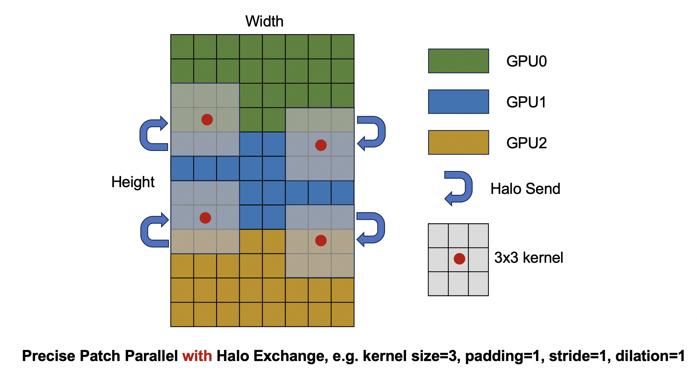
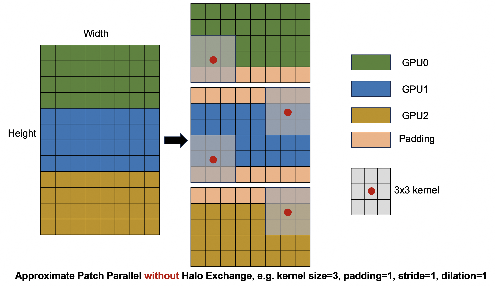
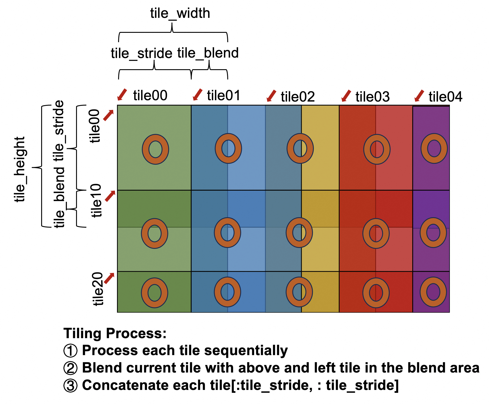

# 1. 背景
在[xDiT](https://github.com/xdit-project/xDiT)的子项目[DistVAE](https://github.com/xdit-project/DistVAE)中，实现了对高分辨率图像的序列并行VAE解码，这种方法显著降低了推理时所需的峰值显存，具体来说，显存占用可降低至原来的1/N，其中N是所使用的设备数量。然而，DistVAE仅实现了VAE解码器在推理阶段的并行处理，在编码器部分并未实现相应的并行支持。同时，它没有涉及训练过程中反向传播的并行计算，且仅支持2D图像处理，不适用于当前在视频生成场景下的3D Causal VAE结构。

在[diffusers](https://github.com/huggingface/diffusers)中使用的[tiling](https://github.com/huggingface/diffusers/blob/main/src/diffusers/models/autoencoders/autoencoder_kl_wan.py)分块技术也是用于降低推理阶段的显存占用。它的核心思想是将输入数据划分为多个小块，逐个处理这些小块，从而减少每个时刻GPU上需要存储的数据量。这种方式虽然能显著降低显存使用，但会增加推理时延。

为了解决上述问题，我们提出了ParaVAE，一个支持高效训练与推理的3D Causal VAE并行实现方案。针对训练场景，采用sequence parallel和slicing技术，显著降低显存占用和训练延迟；针对推理场景，结合tiling进一步压缩显存占用，同时可利用sequence parallel和slicing技术来缓解因分块带来的推理延迟问题。实际测试表明，在训练阶段，ParaVAE可将中间激活值所需的峰值显存降低至原来的1/N（N为设备数）；在推理阶段，对于输入形状为(1, 3, 21, 1024, 2048)的视频数据，ParaVAE能够将峰值显存占用降低多达12倍。
# 2. 设计背后的思考
## 2.1 Parallel
将输入特征图在height维度划分为多个patch，并在多个设备上进行VAE encode和decode过程的序列并行，可以将训练过程中间激活值的峰值显存占用降低到原来的1/N，N是使用的设备数目。在对特征图进行patch后，为了保证每个patch能独立完成卷积计算，需要从相邻分片中复制一些数据过来，这些复制过来的数据就构成了halo region，对halo region的复制过程称为halo exchange。根据在并行过程中是否进行halo exchange，分别实现了精确并行Precise Patch Parallel和近似并行Approximate Patch Parallel。

### 2.1.1 Precise Patch Parallel
精确并行，Precise Patch Parallel通过执行halo exchange过程，保证了并行与非并行情况下卷积计算结果的一致性。

  

### 2.1.2 Approximate Patch Parallel
近似并行，Approximate Patch Parallel直接对特征图在height方向进行切分，分块后各个子块独立进行padding，在视频生成的推理结果上无明显可视化差异，但无法保证和非并行情况卷积计算的一致性，不适用于对精度要求高的训练场景。

  

## 2.2 Tiling
Tiling策略的核心思想是把一个大的输入图像/视频分块（tile）处理，每次只解码一小块区域，避免一次性加载全部数据到GPU显存中。但是单纯地分块计算，会造成大量halo区域丢失，导致计算结果的精确度与非tling相比差异较大，为了缓解这种误差，需要进行有重叠地分块，即当前tile和周围tile是有重叠部分的，各个tile先单独计算；然后对当前tile和其左侧与上侧tile的重叠部分进行融合；最后取每个tile的[:tile_stride,:tile_stride]部分进行拼接。

  

## 2.3 Slicing
Slicing策略的核心思想是将一个batch中的多个样本逐个处理（按batch维度拆分），而不是一次性处理整个batch，从而降低显存占用。

# 3. 不同场景下的策略选择
**Patch Parallel (Inference + Training)**：Patch Parallel通过将输入特征图划分到不同设备上，无论对于VAE训练还是推理，都可以降低峰值显存占用，同时降低训练和推理的时延。

**Slicing (Inference + Training)**：Slicing类似Patch Parallel，只不过Patch Parallel是将输入特征图按照height维度切分，而Slicing是在batch维度进行切分。Slicing只能用于多batch场景的训练与推理并行加速与降低显存占用，Patch Parallel应用范围更广，单batch多batch都可以，允许VAE处理更高分辨率的图像与视频。

**Tiling (Inference)**：Tiling将输入特征图拆分为小块依次处理，来降低推理过程的峰值显存占用。但是，Tiling策略在训练过程中是没有意义的，因为训练过程中需要保存所有的中间激活值，这样即使进行了分块，各个分块的激活值仍需被保存，和不分块没有区别；甚至如果按照上面介绍的重叠分块方式，还会增加中间激活值的显存占用。因此，Tiling策略仅用于在VAE推理过程中降低峰值显存占用。另外，在推理过程中采用Tiling策略，还会带来推理时延的增加，因为将特征图分块依次处理，无法充分利用GPU强大的计算能力。

**Patch Parallel + Tiling (Inference)**：如果推理时，先并行再做Tiling，相比于在单个设备只做Tiling，并不会显著降低峰值显存占用，因为只要进行了分块，无论多卡还是单卡，中间计算过程的显存占用仅取决于分块大小。但是并行可以缓解Tiling带来的推理时延增加问题。
